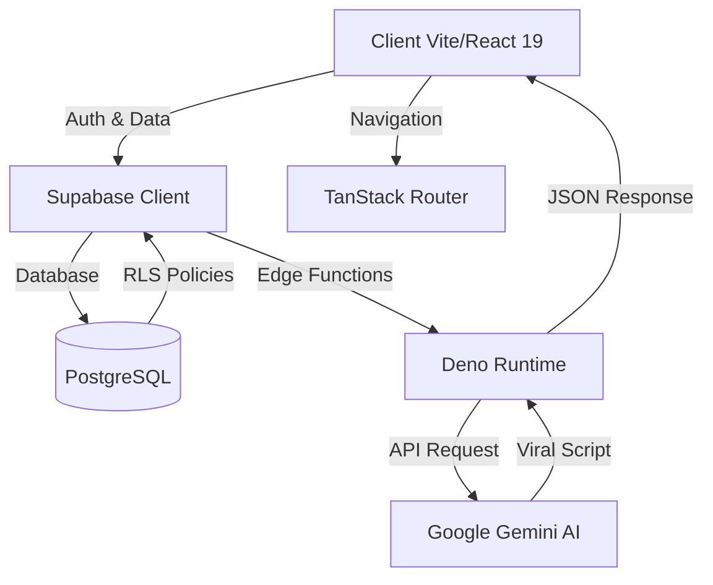

# 🚀 TikTok Booster Script (Achakourou AI)
**La plateforme SaaS n°1 pour la croissance des créateurs TikTok au Sénégal et en Afrique.**

[](https://react.dev/)
[](https://www.typescriptlang.org/)
[](https://supabase.com/)
[](https://deepmind.google/technologies/gemini/)
[](https://vitejs.dev/)

---

## 📝 Présentation
**TikTok Booster Script** est une solution SaaS innovante développée par **Issa KAMARA** (Achakourou Digital Services). Elle est spécifiquement conçue pour lever les barrières à l'entrée des créateurs de contenu africains en utilisant l'intelligence artificielle pour maximiser la viralité et la visibilité organique.

### 🌍 Notre Vision
Permettre à chaque créateur, du Sénégal à toute l'Afrique francophone, de transformer ses idées en succès viraux, même avec une connexion 3G et un smartphone d'entrée de gamme.

## ✨ Fonctionnalités Clés

- ⚡ **Authentification Sans Friction** : Inscription instantanée. Aucune confirmation email, aucun OTP, aucun blocage. L'utilisateur est opérationnel en moins de 10 secondes.
- 🧠 **Générateur de Scripts IA (Gemini 1.5 Flash)** : Création de scripts structurés pour la rétention (Hook captivant, Valeur ajoutée, CTA viral).
- 📈 **Analyseur de Tendances Locales** : Identification des sons et sujets chauds au Sénégal et en Afrique de l'Ouest.
- 🔍 **Optimisation SEO TikTok** : Générateur de hashtags intelligents et optimisation de descriptions pour dominer l'algorithme de recherche TikTok.
- 📱 **Expérience Mobile-First & Low-Bandwidth** : Interface ultra-légère optimisée pour les réseaux mobiles instables.

---

## 🚀 Stratégie de Croissance & SEO

L'application intègre une architecture de **Programmatic SEO** pour dominer les recherches liées à TikTok en Afrique.

1.  **Pages Dynamiques** : Génération automatique de pages `/hashtags/[niche]` et `/hooks/[type]` pour capter le trafic de longue traîne.
2.  **Performance Web** : Score Lighthouse visé de 90+ sur mobile grâce au lazy loading et à la compression d'assets.
3.  **Local SEO** : Optimisation spécifique pour Dakar, Thiès et les grandes métropoles francophones.

---

## 👤 Développeur & Branding
**Issa KAMARA** — Développeur Frontend & Entrepreneur Digital.

- **Portfolio 3D** : issa-kamara-portfolio-3d.web.app
- **GitHub** : @IssaKamara958
- **TikTok** : @reactdev958

## 🏗 Architecture Système



## 🛠 Stack Technique

| Secteur | Technologies |
| :--- | :--- |
| **Frontend** | React 19, Vite, TypeScript 5 |
| **Routing** | TanStack Router / Start |
| **Data Fetching** | TanStack Query v5 |
| **UI/UX** | Tailwind CSS, Shadcn UI, Framer Motion |
| **Backend** | Supabase (PostgreSQL, Auth, Edge Functions) |
| **IA** | Google Gemini 1.5 Flash |

## � Structure du Projet

```text
├── src/
│   ├── components/       # Composants UI atomiques et complexes (Shadcn)
│   ├── hooks/            # Hooks personnalisés (Query, Auth)
│   ├── integrations/     # Configuration Supabase & clients API
│   ├── routes/           # Architecture des routes (File-based)
│   ├── lib/              # Utilitaires et fonctions partagées
│   └── AuthContext.tsx   # Gestion globale de la session sans friction
├── supabase/
│   ├── functions/        # Deno Edge Functions (Création de profils, IA)
│   └── migrations/       # Schémas SQL et politiques RLS
└── public/               # Assets statiques
```

## 🚀 Installation & Configuration

### Pré-requis
- Node.js 18+ ou **Bun** (recommandé)
- Un projet Supabase actif
- Une clé API Google Gemini

### Étapes

1. **Clonage du repository** :
   ```bash
   git clone https://github.com/votre-repo/achakourou-tiktok-ai.git
   cd achakourou-tiktok-ai
   ```

2. **Installation des dépendances** :
   ```bash
   bun install
   ```

3. **Configuration de l'environnement** :
   Créez un fichier `.env` à la racine :
   ```env
   VITE_SUPABASE_URL=https://your-project-id.supabase.co
   VITE_SUPABASE_ANON_KEY=your-anon-public-key
   # Pour les Edge Functions
   GEMINI_API_KEY=votre_cle_gemini
   ```
   *Note : Retrouvez vos identifiants Supabase dans Settings > API.*

4. **Déploiement des fonctions (optionnel)** :
   ```bash
   supabase functions deploy generate-viral-script
   ```

5. **Lancement** :
   ```bash
   bun dev
   ```

## 💡 Guide d'Utilisation

1. **Connexion** : Créez un compte via l'authentification sécurisée Supabase.
2. **Génération** : Saisissez votre sujet ou niche dans le dashboard.
3. **Personnalisation** : Choisissez le ton (Humoristique, Éducatif, Storytelling).
4. **Export** : Copiez votre script optimisé et les recommandations de hashtags directement dans TikTok.

## � Sécurité

- **Isolation des données** : Row Level Security (RLS) activé pour garantir que chaque utilisateur n'accède qu'à ses propres scripts.
- **Quotas IA** : Limitation automatique (ex: 10 générations/jour) gérée côté serveur pour prévenir les abus.
- **Validation** : Toutes les entrées sont sanitizées avant d'être envoyées à l'API Gemini.

---
*© 2026 Achakourou Digital Services. Propulsé par l'innovation.*