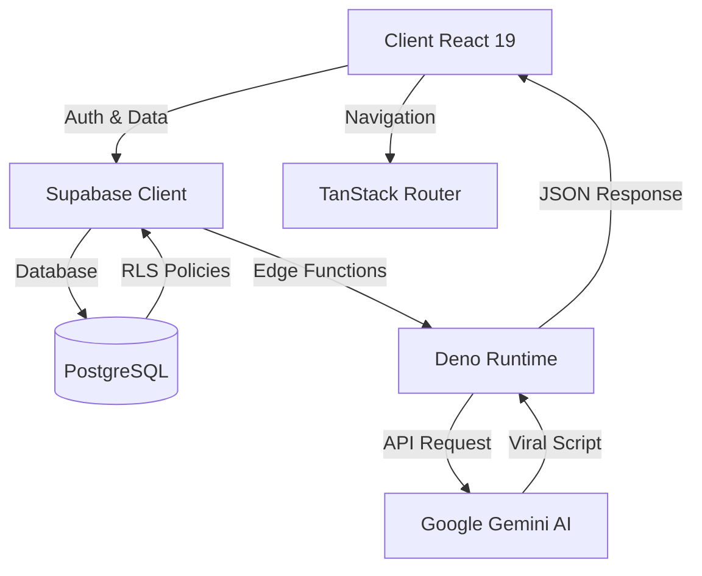

# 🚀 Achakourou TikTok AI
**The Ultimate AI-Powered Growth Platform for Content Creators**

[](https://react.dev/)
[](https://www.typescriptlang.org/)
[](https://supabase.com/)
[](https://deepmind.google/technologies/gemini/)

---

## 📝 Présentation
**Achakourou** est une plateforme SaaS de pointe conçue par **Achakourou Digital Services** (Dev: Issa KAMARA) pour automatiser et optimiser la croissance organique sur TikTok. 

Grâce à l'intégration de l'IA **Gemini 1.5 Flash**, la plateforme permet de transformer des idées brutes en contenus viraux grâce à une analyse prédictive des tendances et une optimisation SEO avancée.

## ✨ Fonctionnalités Clés

- 🧠 **Générateur de Scripts Viraux** : Création de scripts basés sur des structures de rétention éprouvées (Hook, Value, CTA).
- 📊 **Analyseur de Tendances** : Analyse en temps réel des niches pour identifier les opportunités.
- 🔍 **Audit SEO TikTok** : Optimisation des profils, bios et hashtags pour maximiser la découvrabilité.
- ⚡ **Edge Processing** : Traitement ultra-rapide via les Edge Functions de Supabase.

## 🏗 Architecture Système



## 🛠 Stack Technique

| Secteur | Technologies |
| :--- | :--- |
| **Frontend** | React 19, Vite, TypeScript |
| **Routing** | TanStack Router (File-based) |
| **State Management** | TanStack Query v5 |
| **UI/UX** | Tailwind CSS, Shadcn UI, Framer Motion |
| **Backend/DB** | Supabase (PostgreSQL, Auth, Realtime) |
| **Logic (AI)** | Supabase Edge Functions (Deno), Gemini 1.5 Flash |

## � Structure du Projet

```text
├── src/
│   ├── components/       # Composants UI atomiques et complexes (Shadcn)
│   ├── hooks/            # Hooks personnalisés (Query, Auth)
│   ├── integrations/     # Configuration Supabase & clients API
│   ├── routes/           # Architecture des routes (TanStack Router)
│   └── lib/              # Utilitaires et fonctions partagées
├── supabase/
│   ├── functions/        # Edge Functions (Logique IA Gemini)
│   └── migrations/       # Schémas SQL et politiques RLS
└── public/               # Assets statiques
```

## 🚀 Installation & Configuration

### Pré-requis
- Node.js 18+ ou **Bun** (recommandé)
- Un projet Supabase actif
- Une clé API Google Gemini

### Étapes

1. **Clonage du repository** :
   ```bash
   git clone https://github.com/votre-repo/achakourou-tiktok-ai.git
   cd achakourou-tiktok-ai
   ```

2. **Installation des dépendances** :
   ```bash
   bun install
   ```

3. **Configuration de l'environnement** :
   Créez un fichier `.env` à la racine :
   ```env
   VITE_SUPABASE_URL=votre_url_supabase
   VITE_SUPABASE_ANON_KEY=votre_cle_anon
   # Pour les Edge Functions
   GEMINI_API_KEY=votre_cle_gemini
   ```

4. **Déploiement des fonctions (optionnel)** :
   ```bash
   supabase functions deploy generate-viral-script
   ```

5. **Lancement** :
   ```bash
   bun dev
   ```

## 💡 Guide d'Utilisation

1. **Connexion** : Créez un compte via l'authentification sécurisée Supabase.
2. **Génération** : Saisissez votre sujet ou niche dans le dashboard.
3. **Personnalisation** : Choisissez le ton (Humoristique, Éducatif, Storytelling).
4. **Export** : Copiez votre script optimisé et les recommandations de hashtags directement dans TikTok.

## � Sécurité

- **Isolation des données** : Row Level Security (RLS) activé pour garantir que chaque utilisateur n'accède qu'à ses propres scripts.
- **Quotas IA** : Limitation automatique (ex: 10 générations/jour) gérée côté serveur pour prévenir les abus.
- **Validation** : Toutes les entrées sont sanitizées avant d'être envoyées à l'API Gemini.

---
*© 2026 Achakourou Digital Services. Propulsé par l'innovation.*